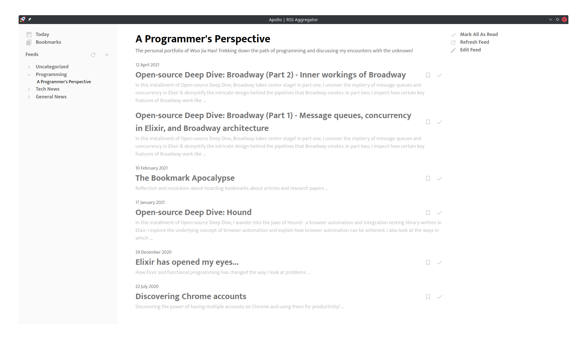
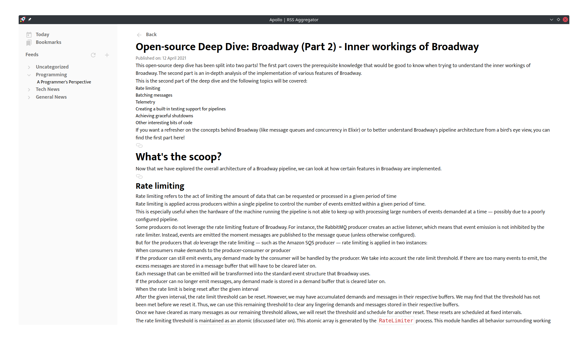

<div align="center">
  <h1 align="center" style="border: none">APOLLO</h1>
  <p>
   <strong>Open-source RSS Aggregator</strong>
  </p>
  <em>RSS Made Easy</em>
  
  
</div>

## Installation

Currently, Apollo can be installed locally only. It requires a database `apollo-test` to be created in PostgreSQL.

```bash
createdb -U postgres apollo-test
git clone https://github.com/woojiahao/apollo.git
cd apollo/
npm i
npm run start
```

## Tech Stack

Apollo uses the following technologies:

- Electron
- Typescript
- React
- Tailwind
- PostgreSQL

## Lessons learnt

- React Rotuer can be used to help with "view switching" (i.e. having a SPA for an Electron app) and help to remove the need for maintaining a shared state across applications (i.e. each view, when reloaded, can reload the data accordingly based on the path provided)
- Communication between the main and renderer processes should be managed using IPC

## Refresh feed algorithm

To determine if an article is newly added to the feed, we employ the follow algorithm:

1. Retrieve existing feed with articles from database
2. Fetch the latest version of the feed
3. For each feed,
   1. Compare the existing list of articles against the latest list of articles*
   2. If an article is completely new, add it to the list of existing articles
   3. If an article exists but has been updated, update it in the list of existing articles
4. Commit any changes made to the database

```markdown
* - Given that an article must include either a title or description, we will use those as a measure of "new".
    If the article from the latest pulled feed has a completely different title/description, then that is a new article
    If the article from the latest pulled feed has the same title/description, but differing content/link, we will 
      update that instead.

    To make it easier to compare the contents, we will encode the content to Base-64
```

## TODO

- [X] Cache articles
- [X] Auto refresh all feeds when first launching app
- [X] Today feature
- [ ] Schedule refreshes for specific feeds
- [ ] Feed-specific actions like editing tag/name
- [ ] Deleting feeds
- [ ] Dark theme
- [ ] Bookmarks feature
- [ ] Handle the other types of RSS feed formats like [Dublin Core](https://www.rssboard.org/rss-profile#namespace-elements-dublin)